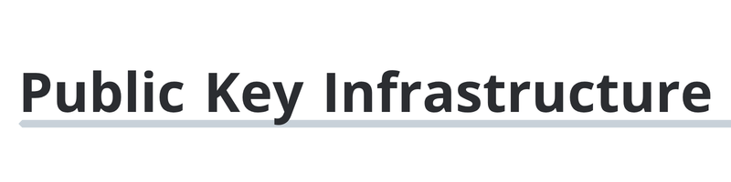
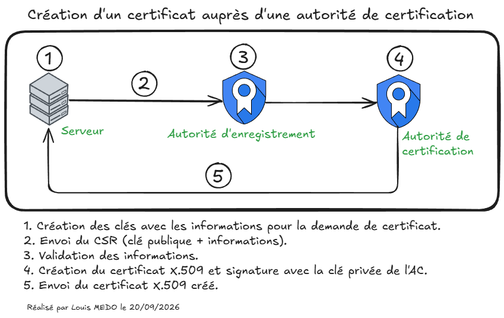
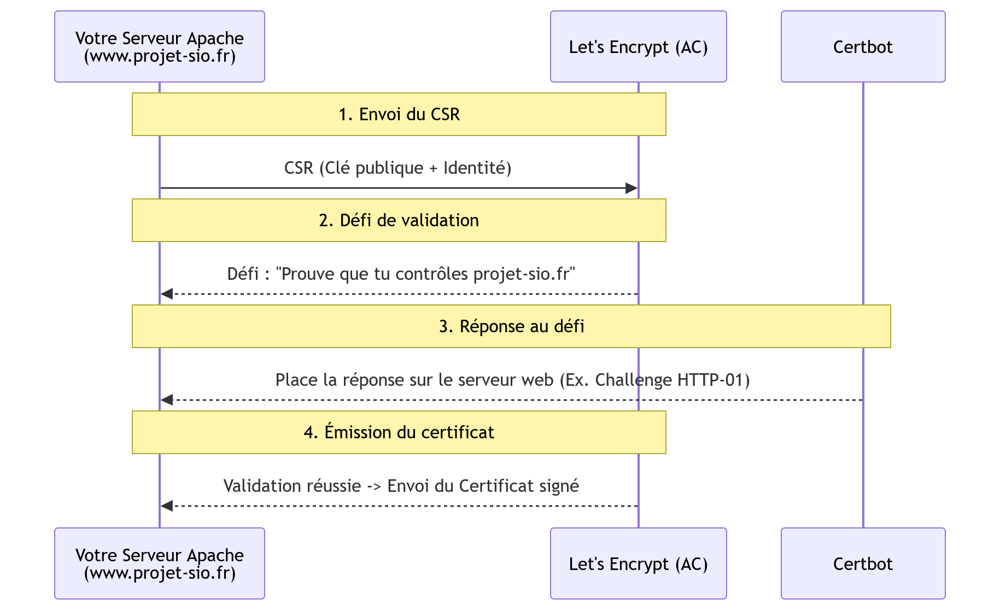

# Présentation de la notion de PKI



*Écrit par Louis MEDO et Amine KADA.*

## 1. Introduction

Nous allons aborder la notion de PKI (Infrastructure à Clés Publiques). Il s'agit d'un système fondamental en cybersécurité, principalement utilisé pour sécuriser les sites web, chiffrer les communications et authentifier les utilisateurs sur un réseau.

Afin de vous permettre de maîtriser ce système de A à Z, nous allons aborder ce chapitre de manière progressive.

Nous commencerons par **définir précisément ce qu'est une PKI** pour bien cerner ses enjeux. Ensuite, nous décortiquerons **son fonctionnement interne** afin de comprendre la mécanique des clés et des certificats numériques. Une fois la théorie acquise, nous ferons un tour d'horizon des différents **outils présents sur le marché** pour vous préparer aux standards de l'entreprise. Enfin, nous passerons à la pratique en réalisant ensemble la **mise en place technique de votre propre PKI**.

## 2. Qu'est-ce qu'une PKI ?

### 2.1. La Genèse

Aux débuts des réseaux, sécuriser des échanges nécessitait de partager une clé secrète, avec le risque constant qu'elle soit interceptée lors de son transfert. L'invention de la cryptographie asymétrique (une clé publique accessible à tous, une clé privée gardée secrète) a révolutionné ces échanges.

Cependant, une faille majeure persistait : si vous recevez la clé publique d'un site web, comment avoir la certitude qu'elle appartient bien à ce site et non à un pirate qui se fait passer pour lui (attaque de l'homme du milieu) ? C'est pour combler ce manque de confiance qu'a été inventée la PKI. Elle introduit la notion de **tiers de confiance**. Son rôle est de vérifier l'identité d'un serveur ou d'une personne, puis de lui délivrer un "passeport numérique" infalsifiable qui contient sa clé publique : le **certificat numérique**.

### 2.2. L'utilisation de la PKI aujourd'hui

De nos jours, la PKI est le socle invisible de la sécurité numérique. Elle est au cœur du protocole HTTPS (le cadenas dans votre navigateur), mais elle sert également à sécuriser les tunnels VPN, à signer numériquement des documents ou encore à authentifier des utilisateurs sur le réseau d'une entreprise (via 802.1X par exemple).

Sur Internet, ce sont de grandes entreprises ou organisations, appelées Autorités de Certification (AC), qui valident et signent ces certificats. On retrouve historiquement des fournisseurs commerciaux (payants) très connus comme **DigiCert**, **GlobalSign** ou **Sectigo**. Cependant, l'écosystème a été bouleversé par l'arrivée de **Let's Encrypt**. Cette autorité de certification a totalement démocratisé la sécurité web en proposant des certificats gratuits, ouverts et dont le renouvellement est entièrement automatisé. C'est en grande partie grâce à Let's Encrypt que le trafic web mondial est aujourd'hui chiffré par défaut.

## 3. Le fonctionnement d'une PKI

Pour comprendre la mécanique d'une PKI, il faut identifier ses acteurs et suivre le parcours d'une demande de certificat.

### 3.1. Les acteurs du système

Trois entités principales interagissent au sein d'une PKI :

- **L'Entité finale (Client/Serveur) :** Celui qui a besoin d'un certificat pour prouver son identité.
- **L'Autorité d'Enregistrement (AE) :** C'est le guichet de vérification. Son rôle est de s'assurer que l'entité est bien celle qu'elle prétend être.
- **L'Autorité de Certification (AC) :** C'est le tiers de confiance. Elle agit comme l'État qui imprime le passeport : elle génère et signe numériquement le certificat.

<div style="page-break-before: always;"></div>

### 3.2. Le Certificat X.509

Le standard utilisé pour les certificats est le format X.509. C'est un document numérique public qui lie une identité à une clé cryptographique. Il est rendu infalsifiable grâce à la signature de l'AC.

```Plaintext
+------------------------------------+
|          Certificat X.509          |
+------------------------------------+
| 1. Identité (Nom de domaine, IP..) |
| 2. Clé Publique de l'entité        |
| 3. Dates de validité (Début / Fin) |
| 4. Nom de l'AC émettrice           |
+------------------------------------+
|      [ Signature de l'AC ]         |
+------------------------------------+
```

### 3.3. Le cycle de vie (Chronologie d'une demande)

La création d'un certificat suit un processus en 4 étapes pour garantir que la clé privée ne transite jamais sur le réseau.

1. **Génération des clés :** L'entité crée elle-même son jeu de clés (Privée / Publique). La clé privée reste secrète sur son serveur.
2. **La demande (CSR) :** L'entité génère un fichier CSR (_Certificate Signing Request_) contenant son identité et sa clé publique, puis l'envoie à l'AE.
3. **La validation :** L'AE vérifie l'identité du demandeur (ex: validation qu'il possède bien le nom de domaine).
4. **L'émission :** L'AC prend les données du CSR, crée le certificat X.509, le signe avec sa propre clé privée, et le renvoie à l'entité.



### 3.4. La Révocation

Que se passe-t-il si un pirate vole la clé privée de votre serveur avant l'expiration du certificat ? Il faut pouvoir annuler ce certificat. La PKI propose deux mécanismes :

- **La CRL (Certificate Revocation List) :** Une liste noire statique téléchargée par le client. Si le numéro de série du certificat y figure, il est rejeté.
- **L'OCSP (Online Certificate Status Protocol) :** Un protocole qui permet au navigateur d'interroger en temps réel l'AC pour connaître le statut exact ("Bon", "Révoqué" ou "Inconnu") d'un certificat précis.

### 3.5. La chaîne de confiance

Pour des raisons de sécurité critique, une AC ne signe presque jamais les certificats finaux directement. La PKI repose sur une architecture hiérarchique :


Le navigateur de l'utilisateur fait confiance à l'AC Racine par défaut car elle est préinstallée dans son magasin de confiance (OS). Cependant, l'AC Intermédiaire (Sub CA) n'y figure pas. C'est le serveur qui la transmet au navigateur lors de la connexion, accompagnée de son propre certificat. Le navigateur vérifie alors la signature : il fait confiance à la Racine → qui a signé l'Intermédiaire → qui a signé le Serveur. C'est ce qu'on appelle l'héritage de confiance.

L'AC Racine est gardée hors-ligne (souvent dans un coffre-fort physique) : si sa clé privée était compromise, c'est l'intégralité de la PKI qui s'effondrerait. »

### 3.6 Exemple avec un serveur web

Maintenant, nous allons mettre une image sur ces concepts. Imaginons que vous deviez passer le site de votre projet de BTS (`www.projet-sio.fr`) hébergé sur un serveur Apache en HTTPS. Pour cela vous allez devoir utiliser les concepts vu ci-dessus.

#### 3.6.1. Phase 1 : L'obtention du certificat (Côté serveur)

Vous allez utiliser un outil appelé **Certbot**, qui est un client automatisé agissant sur votre serveur pour communiquer avec l'AC Let's Encrypt.

1. **Génération :** Certbot génère une clé privée (qui restera cachée sur votre serveur Apache) et un fichier CSR contenant la clé publique et le nom de domaine (`www.projet-sio.fr`).
2. **Défi (Challenge) :** Let's Encrypt reçoit le CSR et doit valider que vous contrôlez bien ce domaine (rôle de l'AE). Il vous lance un défi (généralement placer un fichier temporaire spécifique à la racine de votre serveur web).
3. **Émission :** Let's Encrypt télécharge ce fichier depuis votre Apache. Le défi est réussi. Let's Encrypt signe numériquement votre clé publique et vous renvoie le certificat X.509. Certbot l'installe automatiquement dans la configuration d'Apache.



#### Phase 2 : La vérification (Côté client)

Maintenant que votre serveur Apache est configuré avec sa clé privée et son certificat public, que se passe-t-il lorsqu'un utilisateur se connecte à `https://www.projet-sio.fr` ?


1. **La présentation :** L'utilisateur tape l'URL. Votre serveur Apache lui répond immédiatement en lui envoyant son certificat X.509.
2. **Le contrôle d'identité (Vérification mathématique) :**
	Le navigateur web de l'utilisateur (Firefox, Chrome...) effectue trois contrôles en autonomie :
	- **Vérification de la signature :** Le navigateur possède déjà, préinstallé dans son propre code source, le certificat Racine de Let's Encrypt. Il l'utilise pour vérifier mathématiquement la signature de votre certificat. S'il a été altéré, le calcul échoue.
	- **Vérification de la concordance :** Il vérifie que le nom inscrit dans le certificat (`www.projet-sio.fr`) correspond exactement à l'URL tapée dans la barre d'adresse.
	- **Vérification de la validité :** Il contrôle les dates de début et de fin (est-il expiré ?).
3. **Le contrôle de révocation :** Pour s'assurer que la clé privée du serveur n'a pas été volée récemment, le navigateur interroge l'autorité de certification Let's Encrypt en temps réel (via le protocole OCSP).
4. **La confiance établie :** Si toutes ces étapes sont au vert, le navigateur affiche le fameux **cadenas fermé**. Le navigateur et le serveur Apache peuvent alors utiliser la clé publique du certificat pour s'échanger une clé de session chiffrée et démarrer une communication sécurisée invisible pour le reste du réseau.

## 4. Les outils de PKI sur le marché

**Distinction fondamentale : PKI Publique vs PKI Interne** Avant de choisir un outil, il faut délimiter votre périmètre de confiance :

- **PKI Publique (Internet) :** Fait autorité mondialement. Les certificats racines sont préinstallés dans tous les navigateurs et systèmes d'exploitation. (ex: Let's Encrypt, DigiCert). Indispensable pour un site web grand public.
- **PKI Interne (Entreprise) :** Fait autorité uniquement au sein de votre réseau local. L'administrateur doit forcer le déploiement du certificat racine sur les postes de l'entreprise. Indispensable pour sécuriser un intranet, un pare-feu, un VPN ou le Wi-Fi interne sans dépendre d'un acteur externe.

Voici 3 solutions pour déployer une PKI interne :

### 1. Microsoft AD CS (Active Directory Certificate Services)

- **Modèle :** Propriétaire (Rôle inclus dans Windows Server).
- **Principe :** Il s'intègre nativement à l'annuaire Active Directory.
- **Cas d'usage :** Déploiement automatique (auto-enrollment) de certificats sur tous les ordinateurs du domaine via les GPO (Stratégies de Groupe). Idéal pour l'authentification réseau (802.1X) ou le chiffrement de fichiers locaux.

### 2.  Step-CA

- **Modèle :** Open-Source et Auto-hébergé.
- **Principe :** Une approche pensée pour le DevOps, le Cloud et l'Infrastructure as Code (IaC). Tout se gère par API, sans interface graphique lourde.
- **Cas d'usage :** Génération de certificats à la volée avec une durée de vie très courte (quelques heures) pour sécuriser des communications entre des conteneurs (Docker, Kubernetes) ou des serveurs Linux.

### 3. XCA (X Certificate and Key management) / OpenSSL

- **Modèle :** Logiciel libre (Client lourd Windows/Linux/macOS).
- **Principe :** C'est une interface graphique conviviale qui s'appuie sur le moteur historique "OpenSSL" (qui s'utilise normalement en ligne de commande pure). L'intégralité de la base de données de la PKI tient dans un seul fichier chiffré.
- **Cas d'usage :** Parfait pour l'apprentissage en BTS, pour créer une mini-PKI manuelle de test, ou pour générer rapidement les certificats d'un tunnel OpenVPN dans une très petite structure.

## 5. Mise en place d'une PKI

[Procédure de mise en place d'une PKI avec Step-CA](mettre lien)

## 6. Sources

- DigiCert – Qu'est-ce que la PKI ? : [https://www.digicert.com/fr/what-is-pki](https://www.digicert.com/fr/what-is-pki)
- Sectigo – Qu'est-ce qu'un certificat X.509 : [https://www.sectigo.com/fr/blog/qu-est-ce-qu-un-certificat-x509](https://www.sectigo.com/fr/blog/qu-est-ce-qu-un-certificat-x509)
- Okta – Identity 101 : PKI : [https://www.okta.com/fr-fr/identity-101/public-key-infrastructure/](https://www.okta.com/fr-fr/identity-101/public-key-infrastructure/)
- Microsoft Learn – AD CS : [https://learn.microsoft.com/fr-fr/windows-server/identity/ad-cs](https://learn.microsoft.com/fr-fr/windows-server/identity/ad-cs)
- Smallstep (step-ca) – GitHub : [https://github.com/smallstep/certificates](https://github.com/smallstep/certificates)
- Tech Talk: What is Public Key Infrastructure (PKI)? : [https://www.youtube.com/watch?v=0ctat6RBrFo](https://www.youtube.com/watch?v=0ctat6RBrFo)
- Comprendre le chiffrement SSL / TLS avec des emojis (et le HTTPS) : [https://youtu.be/7W7WPMX7arI](https://youtu.be/7W7WPMX7arI)
