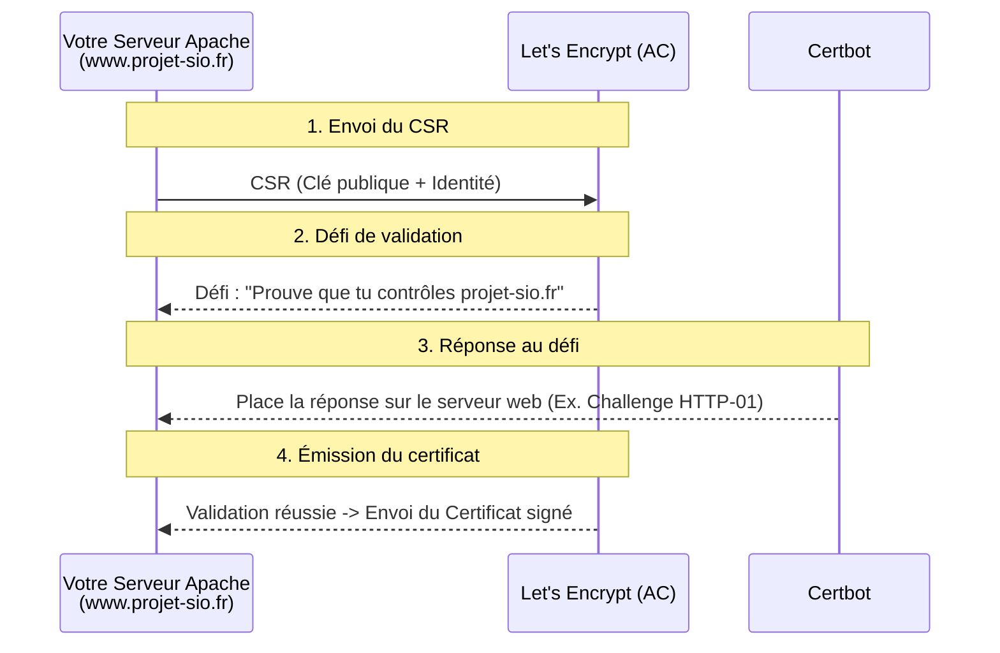

https://mermaid.ai/live/edit

```mermaid
sequenceDiagram
    participant Apache as Votre Serveur Apache<br/>(www.projet-sio.fr)
    participant LE as Let's Encrypt (AC)
    participant CB as Certbot

    Note over Apache, LE: 1. Envoi du CSR
    Apache->>LE: CSR (Clé publique + Identité)

    Note over LE, Apache: 2. Défi de validation
    LE-->>Apache: Défi : "Prouve que tu contrôles projet-sio.fr"

    Note over CB, Apache: 3. Réponse au défi
    CB-->>Apache: Place la réponse sur le serveur web (Ex. Challenge HTTP-01)

    Note over LE, Apache: 4. Émission du certificat
    LE-->>Apache: Validation réussie -> Envoi du Certificat signé
```